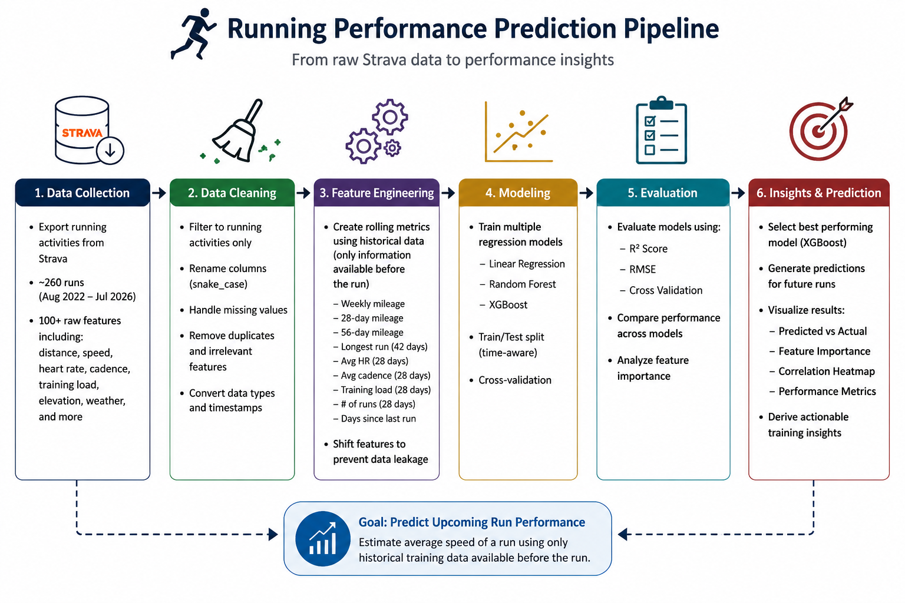
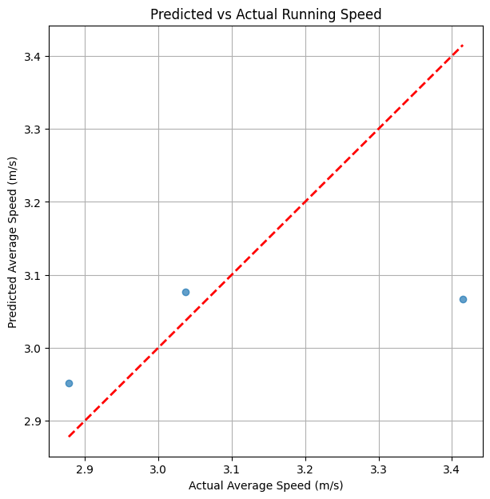
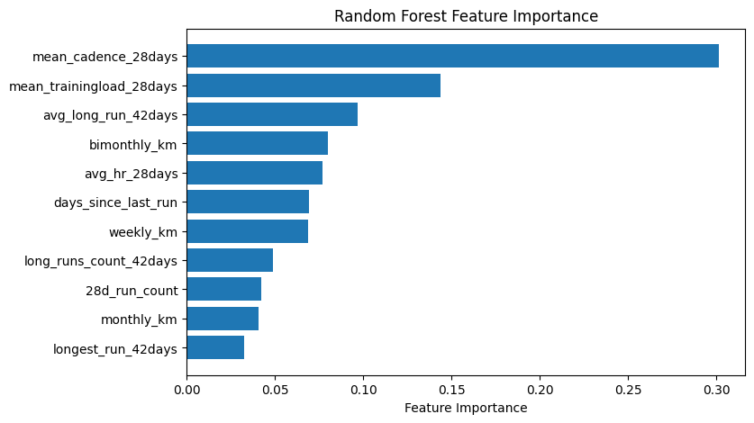

# 🏃 Predicting Running Performance from Historical Strava Training Data

## Overview

This project explores whether historical training metrics from Strava can be used to predict the average speed of an upcoming run.

Using a personal dataset exported from Strava, I built an end-to-end machine learning pipeline that transforms raw activity data into rolling training metrics and evaluates multiple regression models.

The project focuses on realistic prediction by ensuring that only information available **before a run begins** is used as model input.

---

## Motivation

As a marathon runner, I wanted to answer a simple question:

> **Based on my recent training, how fast should I expect to run today?**

Rather than relying on intuition alone, I explored whether machine learning models could identify relationships between historical training volume, consistency, and physiological metrics.

---
## Pipeline


---

## Dataset

- Source: Personal Strava activity export
- Activities included: Running only
- Total runs: ~260
- Time period: August 2022 – July 2026

The original export contained over 100 columns, including:

- Distance
- Average Speed
- Heart Rate
- Cadence
- Training Load
- Elevation
- Relative Effort
- Weather
- Activity Metadata

Many unused or incomplete features were removed during preprocessing.

---

## Data Cleaning

The preprocessing pipeline included:

- Filtering to running activities only
- Renaming columns to consistent snake_case format
- Handling missing values
- Removing duplicate and irrelevant features
- Converting timestamps to datetime
- Converting numeric columns to appropriate data types


---

## Feature Engineering

Historical training metrics were generated using rolling time windows.

Examples include:

- Weekly mileage
- 28-day mileage
- 56-day mileage
- Longest run in previous 42 days
- Number of long runs in previous 42 days
- Average long run distance
- Average heart rate (previous 28 days)
- Average cadence (previous 28 days)
- Average training load (previous 28 days)
- Number of runs in previous 28 days
- Days since previous run


---
## Correlation Heatmap


---
## Weekely Distance Histogram

---


### Preventing Data Leakage

A key challenge in this project was preventing target leakage.

Instead of allowing rolling calculations to include the current run, all rolling features were shifted by one activity so that every feature represents information that would have been available **before** the target run occurred.

---

## Models Evaluated

Three regression models were compared:

- Linear Regression
- Random Forest Regressor
- XGBoost Regressor

Model performance was evaluated using:

- Train/Test R²
- RMSE
- Cross Validation

---

## Results

| Model | Test R² | RMSE |
|--------|---------|------|
| Linear Regression | -0.86 | 0.307 |
| Random Forest | -0.08 | 0.234 |
| XGBoost | **0.16** | **0.207** |

Although predictive performance remains modest, the project demonstrates the complete workflow of developing, evaluating, and improving machine learning models using real-world fitness data.

One important finding was that removing data leakage significantly reduced model performance, highlighting the importance of proper feature engineering and evaluation.


---
## Predicted vs Actual 


---
## Feature Importance
 

---

## Lessons Learned

This project reinforced several practical machine learning concepts:

- Feature engineering often matters more than model selection.
- Preventing data leakage is critical for realistic model evaluation.
- Tree-based models handled nonlinear relationships better than linear regression.
- Personal fitness data contains substantial variability due to workout type, fatigue, terrain, weather, and other factors that are difficult to capture with historical metrics alone.

---

## Future Improvements

Potential next steps include:

- Classifying workout types (easy, tempo, interval, long run)
- Predicting marathon performance instead of individual run speed
- Incorporating weather and terrain features
- Time-series cross validation
- Hyperparameter tuning
- SHAP analysis for feature interpretation

---

## Technologies Used

- Python
- Pandas
- NumPy
- Scikit-Learn
- XGBoost
- Google Colab
- Git

---

## Repository Structure

```
project/
│
├── data/
│   ├── raw/
│   └── processed/
│
├── notebooks/
│   └── Running_Performance_Prediction.ipynb
│
├── images/
│
├── requirements.txt
│
└── README.md
```

---

## Disclaimer

This project was developed for educational and portfolio purposes using my own Strava activity history.

The goal is not to build a production-ready performance predictor, but to demonstrate practical data cleaning, feature engineering, and machine learning workflows using real-world data.
